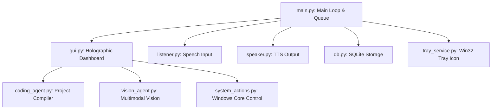

# CHINNI AI OS – ULTIMATE WINDOWS AI ASSISTANT

Chinni AI OS is a complete, production-ready, voice-controlled Windows Operating System Assistant. It runs in the background, minimizes to the system tray, features a stunning Jarvis-inspired holographic dashboard UI, tracks real-time system metrics (CPU, RAM, GPU, Battery, Network IO), and includes powerful offline coding and visual debugging helpers.

---

## 1. PROJECT ARCHITECTURE

The application uses an asynchronous, multi-threaded architecture to prevent blocking of the graphical user interface.



- **Frontend (GUI)**: High-performance Tkinter engine utilizing blue holographic styling (`#050811` background, `#00e5ff` cyan accents, custom canvas animations representing Chinni Core states).
- **Backend (Orchestrator)**: Thread-safe command queue routing voice input streams, manual inputs, and custom macros into execution loops.
- **Database Layer**: SQLite engine supporting 9 primary tables (`settings`, `custom_commands`, `memory`, `projects`, `app_paths`, `notes`, `tasks`, `voice_devices`, `action_logs`).
- **Voice System**:
  - *Wake Word Engine*: Threaded filter matching `"Hey Chinni"`, `"Chinni"`, `"Hey Aegis"`, and `"Aegis"`.
  - *Microphone Manager*: Dynamic hardware selector querying active Bluetooth, wired, or built-in mics and switching dynamically in between cycles without thread collisions.
  - *TTS Engine*: SAPI5-based female voice initialization (volume, speed controls, sandbox test button).
- **Agents**:
  - *Coding Agent*: Direct compiler checks, directory scanning statistics, template generator, and API/Database schema builders.
  - *Screen Vision Agent*: Base64 screenshot/active window capturer hooking into OpenAI's multimodal model (`gpt-4o-mini`) for visual debugging and UI checks.
- **Windows Integration**:
  - *System Tray Service*: `win32gui` daemon supporting restore/exit triggers and registry keys setting boot launch.

---

## 2. DATABASE CONFIGURATION

SQLite database: `jarvis.db`

Primary tables:
1. `settings`: System switches (Wake word, auto-execute, voice configuration rates).
2. `custom_commands`: Macros and alias rules.
3. `memory`: Context parameters.
4. `projects`: Placement milestones anddeadlines.
5. `app_paths`: Executable paths and web browser fallbacks.
6. `notes`: Text records.
7. `tasks`: Checklist schedulers.
8. `voice_devices`: Microphones catalog.
9. `action_logs`: Command history logs.

---

## 3. INSTALLATION GUIDE

### Prerequisites
- Windows 10/11
- Python 3.8+

### Step-by-Step Setup
1. Clone the repository into your workspace.
2. Create and activate a virtual environment:
   ```powershell
   python -m venv .venv
   .venv\Scripts\activate
   ```
3. Install required libraries:
   ```powershell
   pip install -r requirements.txt
   ```
   *Note: On Windows, pywin32, pyttsx3, SpeechRecognition, PyAudio, screen-brightness-control, psutil, and pyautogui are required.*

4. Setup your API Key:
   Create a `.env` file or modify `config.py`:
   ```python
   OPENAI_API_KEY = "your-openai-api-key-here"
   ```

5. Run the assistant:
   ```powershell
   python main.py
   ```

---

## 4. VOICE COMMANDS & ROUTINES REFERENCE

### System Commands
- **Volume**: *"volume up"*, *"volume down"*
- **Brightness**: *"brightness up"*, *"brightness down"*
- **Windows Theme**: *"activate dark mode"*, *"turn on light mode"*
- **PC State**: *"lock screen"*, *"restart pc"*, *"shutdown pc"*, *"sleep pc"*
- **Screenshots**: *"take screenshot"*, *"record screen"*

### File Controls
- **Create**: *"create file project.py"*, *"create folder source"*
- **Delete**: *"delete folder source"*, *"delete file project.py"*
- **Actions**: *"copy file source.py"*, *"paste file"*, *"rename file source.py to index.py"*, *"zip folder source"*, *"extract zip archive"*

### Routine Modes
Macros are custom voice sequences triggered sequentially:
1. **Study Mode**:
   - Trigger: *"Study mode"*
   - Actions: Opens ChatGPT, YouTube, WhatsApp. Speaks: *"Study mode activated."*
2. **Coding Mode**:
   - Trigger: *"Coding mood"*
   - Actions: Opens Gemini, ChatGPT, Antigravity IDE, Spotify. Speaks: *"Coding mode activated."*
3. **Placement Mode**:
   - Trigger: *"Placement mode"*
   - Actions: Opens Resume, LinkedIn, ChatGPT, Interview Dashboard. Speaks: *"Placement mode activated."*
4. **Project Mode**:
   - Trigger: *"Project mode"*
   - Actions: Opens AIPlacement, Portfolio, Full Stack Projects, Internship Tasks. Speaks: *"Project mode activated."*

---

## 5. DEVELOPER AGENTS REFERENCE

### Coding Agent
Import `coding_agent` helper features to:
- **Scan repository**: `coding_agent.read_repository(path)`
- **Explain files**: `coding_agent.explain_file(file_path)`
- **Debug Python files**: Runs compilation check `py_compile.compile(file_path)`. If it fails, calls AI to suggest modifications.

### Screen Vision Agent
Import `vision_agent` visual assistant to:
- **Analyze visible window errors**: `vision_agent.analyze_screen_error()`
- **Audit layouts**: `vision_agent.analyze_ui_layout()`
- **Explain code on screen**: `vision_agent.explain_screen_code()`

---

## 6. WINDOWS STARTUP & TRAY BEHAVIOR

- **System Tray**: When minimized, the window is hidden (`root.withdraw()`). Click the system tray icon in the Windows taskbar, or double-click, to restore. Right-click to show a context menu with "Restore" and "Exit".
- **Startup Boot**: Go to `PREFERENCES` page on the dashboard and toggle "Launch Chinni AI automatically when Windows starts". This writes registry keys in `HKCU\Software\Microsoft\Windows\CurrentVersion\Run`.

---

## 7. WINDOWS EXECUTABLE COMPILATION

To build a standalone Windows Executable (`.exe`), install PyInstaller and run the compilation script:

```powershell
pip install pyinstaller
pyinstaller --noconsole --onefile --icon=icon.ico --name="ChinniAI" main.py
```

Ensure SQLite database `jarvis.db` and script path settings are relative to the executable root directory so they are packaged or generated inline upon launch.
